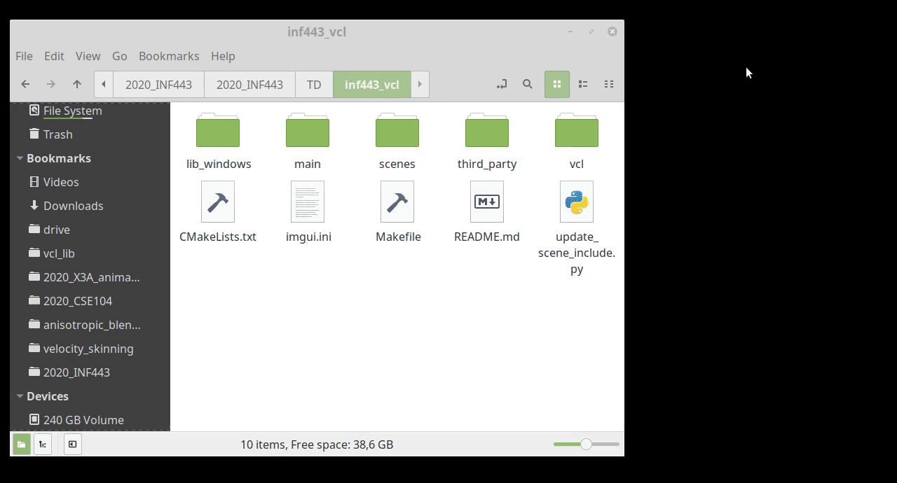
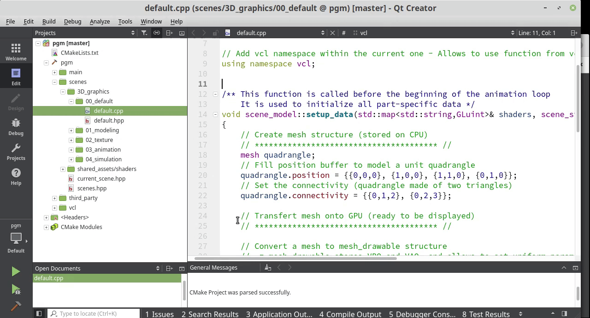
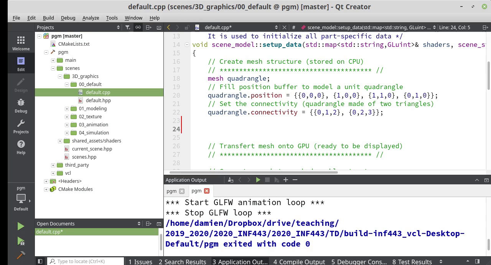

# Setting up QtCreator


- [1. Load project in QtCreator](#load)
- [2. Compiling the code](#compiling)
- [3. Executing the code](#executing)
- [4. Automatic completion](#completion)
- [5. File Navigation](#navigation)
- [Common Issues](#issue)


<br>


QtCreator is an IDE (Integrated Development Environment) for C++. It provides natively


* color encoding
* code completion: automatic proposition of possible variable names, class methods, and show expected function arguments
* allows to quickly navigate through hierarchy of files: Use CTRL + left click on a variable or function to go to its declaration, or on include file to go to navigate to the corresponding one. Pressing F4 navigates between header (.hpp) and source (.cpp) files.
* integrate debugger (visualizing line by line the status of all your variables), as well as a profiler.


QtCreator is able to load a complete project only from the generic CMakeLists.txt configuration file which is already provided. Editing a project with QtCreator doesn't impact the source files.


<br>


_Note that you may use other IDE able to load a project from CMakeLists.txt such as [CLion](https://www.jetbrains.com/clion/) (free for students). <br>
You can also use a more minimalistic text editor (Visual Studio Code, Emacs, Vim, etc.) if you are used to it, but the configuration required to activate smart auto-completion and to easily navigate through the files hierarchy is more complex._


<br>


<a name="load"></a>
## 1. Load project in QtCreator


In **Linux**, you can either 
* open a command line on the root directory (the directory that contains the file CMakeLists.txt) and type
```shell
qtcreator CmakeLists.txt &
```
* or start QtCreator from you application startup panel and then follow
  * **File** -> **Open File or Project** -> [look for the file CMakeLists.txt]

<br>

In **MacOS** you will have to open QtCreator from your launchpad and then follow 
  * **File** -> **Open File or Project** -> [look for the file CMakeLists.txt] <br>

<br>





Whichever method you use, QtCreator should propose to configure the project. Once it is done, you will have access to the hierarchy of files from the left panel.


Check here if you experience problems loading the project: [Common Issues](#issue).


<a name="compiling"></a>
## 2. Compiling the code


The code can be compiled using the small hammer icon on the bottom left, or using the key shortcut: **CTRL+b**





<a name="executing"></a>
## 3. Executing the code


The code can be executed using the green arrow icon on the bottom left, or using the key shortcut: **CTRL+r** 


* the shortcut CTRL+r also runs the compilation if needed.


<br>


The path of the run directory should be set to the root directory otherwise will stop with an error message will indicate that the shader or data file cannot be read (shown in the following image).


To this end


* Go to Projects (left panel)
* On the panel (Build & Run) select Run
* Observe the `Working Directory` entry and set it to the root path of the library


_Explanations_


* The code expect to read some external files (shader files, textures, etc.) in the scenes/ directory. The relative path of these files are within the code.
* The executable should be run from a directory able to access these asset files from the same relative path.
* By default, the executable is run from the temporary parent directory in QtCreator where the executable binary is generated. So the program cannot access to the asset files.
* Either the `working directory` is changed, or, alternatively, you can also copy (only once) the `scene/` directory at the location of the binary file.


<a name="completion"></a>
## 4. Automatic completion


Once the project is loaded, automatic completion will appear automatically and help you write code and use the library.





<a name="navigation"></a>
## 5. Files navigation


In addition to the file hierarchy from the left panel, you can use `CTRL+left click` on element of code to navigate through the code.


* `CTRL+left click` on a type goes to the type definition (useful to understand the library).
* `CTRL+left click` on a function goes to its definition.
* `F4` switch between the header (.hpp) and implementation (.cpp) file. (useful to switch between public signature of a function/class and its implementation).
* `CTRL+left click` on a variable goes to its declaration.
* `CTRL+left click` on a `#include [path]` navigate to this header file.


<a name="issue"></a>
## Common issue to load a project with QtCreator


When QtCreator fails to load your project it is often caused by conflicting temporary files. <br>
In some other cases the project may load but the executable file is not found.

<br>

* Everytime QtCreator load a project, it generates temporary files
  * CMakeListst.txt.user (in the current directory)
  * An entire temporary directory: build-`XX`-Desktop-Default in the parent directory.
* If you have failed previous attempt to open QtCreator, or if you moved your project directory to another place (or to another computer), these temporary files are not anymore coherent.
* You can safely delete this temporary files (CMakeListst.txt.user and the entire directory build-`XX`-Desktop-Default), and restart the process to open QtCreator.

