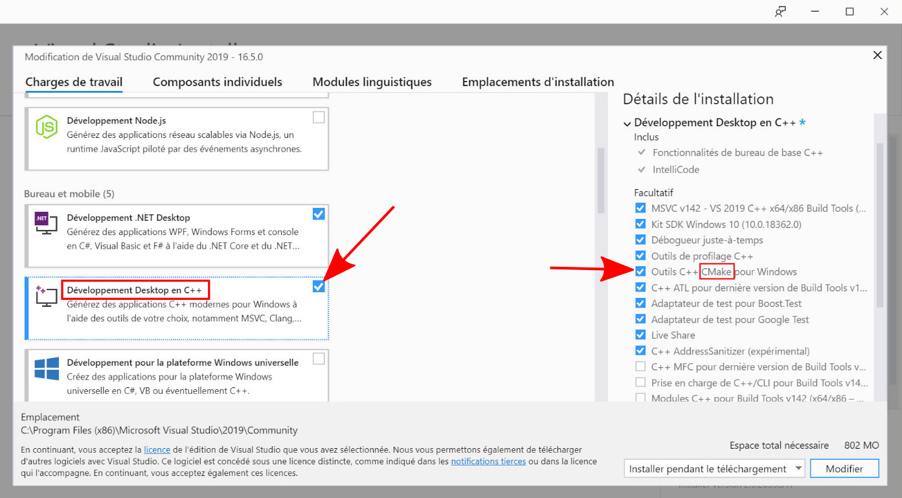

# Tutorials to compile VCL on Windows

* [Software installation](#Software)
* [Loading the project in Visual Studio](#Load)
  * [As a Visual Studio Project](visual_studio_project.md)
  * [Using CMake-Visual tools](visual_studio_cmake.md)
* [Possible issues](#Issue)

< [Back to VCL page](../README.md)

 

## Software installation

Download and install
* [CMake](https://cmake.org/)

 

Then download and install (if it is not installed yet)
*  [Visual Studio](https://visualstudio.microsoft.com/vs/)
  * Make sure you select the options **Desktop development with C++** (to get C++ compiler) and to check **C++ CMake tools for Windows** during the installation procedure (see the image below). 
  * [See official documentation](https://docs.microsoft.com/en-us/cpp/build/vscpp-step-0-installation?view=vs-2019) for more information.
  * _Note that Visual Studio is a large software, so it can take some time_

 

The tutorial expect that you have Visual Studio 2019 (community edition - free for students and open source project).  
Note that Visual Studio is the complete Microsoft IDE + compiler - do not confound it with _Visual Studio Code_ aimed at being a lighter text editor (no embedded compiler).

## Loading the project in Visual Studio

There is two solutions to compile your project using Visual Studio
1. [Create a Visual Studio project from CMake](visual_studio_project.md)
2. [Use the CMake module within Visual Studio](visual_studio_cmake.md)

 

## Possible issues

* If the compilation fails from the beginning with this type of message

"_The C compiler "C:/Program Files (x86)/Microsoft Visual Studio/2019/Community/VC/Tools/MSVC/14.25.28610/bin/HostX64/x64/cl.exe" is not able to compile a simple test program. It fails with the following output_"

You probably didn't install the "**Desktop development with C++**" with Visual Studio (meaning that you don't have C++ compiler). 
You can still install it afterward from the **Tools** -> **Get Tools and Features**.  
([Check here for more information](https://docs.microsoft.com/en-us/cpp/build/vscpp-step-0-installation?view=vs-2019))

 

* If the files compiles, but the last step fails (called linker) on glfw.lib, it means that the pre-compiled version of GLFW included with VLC isn't compatible with your version of Visual Studio or System. You may download the correct version of [precompiled GLFW library](https://www.glfw.org/download.html) for your case (32 bits/64 bits, VS version) and replace the provided lib in `lib_windows/glfw3_win`.

 

* If you have a persitent error after adding a new variable in a class (or change something in a header file), force the option **Rebuild All** at the compilation options (instead of "Build All").
 * Sometimes Visual Studio doesn't handle correctly the modifications in the header files, which are not propagated to the newly compiled filed, which leads at the end to some memory error. Forcing a "Rebuild" ensure that all files are fully recompiled (but it is slower). This step is not needed if you only change the .cpp files.