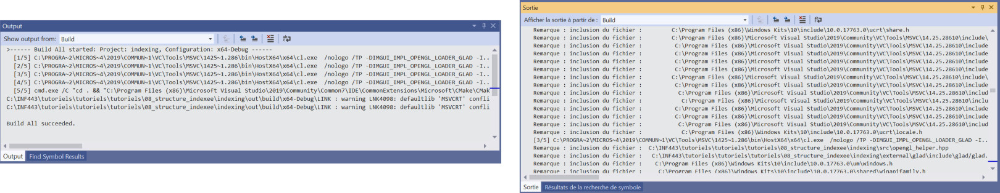

# Compiling VCL using Visual Studio CMake loader

This part describe the steps to load a CMake project within Visual Studio using the embeeded CMake-tools in Visual.

* [Load the project](#Project)
* [Compiling](#Compiling)
* [Executing the program](#Execution)
* [Note on language](#Language)

< [Back to Compilation in Windows](visual_studio.md)

 

## Load the project

* Start Visual Studio, and use the option **continue without code**
* Once the interface is available, follow 
  * **File** -> **Open** -> **CMake**
  * Look for the file **CMakeLists.txt** in the VCL directory where you download the code.

The project should load in Visual Studio. The hierarchy of files should be available through the _Solution Explorer_.

## Compiling

The compilation can be run from the Build menu (or F7).

Check that the compilation ends successfully before trying to execute the program.

## Executing the program

You can execute the program using the green arrow from the panel. (You may need to select `pgm` in the proposed choices)

For the first run, the program should end with an error indicating that some file (usually the shader) cannot be found (see the example in the following animation).

### Explanation of the error

- Once executed, the program tries to read external files (shaders, images, etc).
- These files are expected to be accessible from the executable at the relative path `scenes/...`
- By default, Visual Studio generates the executable in a temporary directory that doesn't follow this expected relative path.

### Solution to apply

- Check the directory where Visual Studio generates  `pgm.exe`
  - This directory can be found in the execution log (see the highlighted path in the video) -> _in this case it is in the `out/` directory placed at the root of the VCL library (may depend on your version of Visual Studio)._
- Copy the entire `scene/` directory of the library in the directory where `pgm.exe` is generated.
  - Note that you only have to copy `scene/` once for all. Even if you change the code, only the data are needed.
  - However, if you want to add new assets (texture, mesh files, etc) or change the shaders, don't forget to do update this copied directory.

 

## Note on language

It is recommended that you install the English version of Visual Studio (instead of the French one for instance) - or change the language once Visual Studio has been installed ([see these steps for instance](https://agirlamonggeeks.com/2019/03/10/how-to-change-language-in-visual-studio-2019-after-installation/)).
* First the terminology will be more standard, especially for debug purposes.
* But more importantly, the compiler output will be much clean and only indicate warning or errors - the french version of the compiler displays every included header file, for every source file, which create huge amount of noise in the compilation output.

_Example on a small projects with four source files_  
_Left - English version: The five steps of the compilation are visible and any warning or error can be seen easily.  Right - French version: The output is obfuscated by the notification of file inclusion; finding a warning or an error is much harder._
